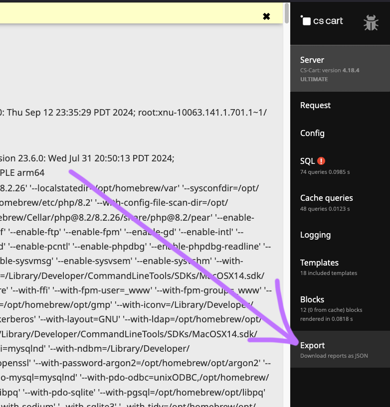

# debug_export

Add-on for CS-Cart. Extracts DEBUG_MODE report data as JSON. Made in Pennsylvania, USA 🇺🇸 by [Breakfast](https://breakfastco.xyz).

## Screenshot

Adds an __Export__ item to the CS-Cart Debug menu.

## Installation

If your site is not using the __Responsive__ theme or an extension of it, copy the file at `design/themes/responsive/templates/addons/debug_export/hooks/index/scripts.post.tpl` into a similar path that your theme will load. 